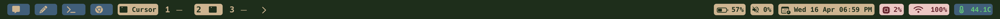

# 🎨 My personal custom sketchybar I use on my macbook pro

<div align="center">
  
  
  
</div>

## 📸 Preview

<div align="center">
  
  <br>
  <em>Full bar preview showing all components</em>
</div>

<div align="center">
  
  
  <br>
  <em>Left and right side components in detail</em>
</div>


## ✨ Features

- 📊 System monitoring (CPU, GPU, Temperature)
- 🚀 Application launchers
- 🖥️ Workspace management
- 🎵 Media controls
- 🔋 Battery status
- 📅 Calendar integration
- 🔊 Volume controls
- 🎨 Custom color schemes

## 📋 Prerequisites

- macOS (tested on macOS Sonoma)
- [Homebrew](https://brew.sh/) package manager
- Git

## 🚀 Quick Start

### 1. Install SketchyBar
```bash
# Install SketchyBar
brew tap FelixKratz/formulae
brew install sketchybar
```

### 2. Install Dependencies
```bash
# System monitoring tools
brew install osx-cpu-temp powermetrics

# Optional: Screenshot tool
brew install --cask shottr
```

### 3. Install Fonts
```bash
# Install Hack Nerd Font
brew tap homebrew/cask-fonts
brew install --cask font-hack-nerd-font
```

### 4. Install Configuration
```bash
# Clone this repository
git clone https://github.com/ajsanna/sketchybar.git ~/.config/sketchybar

# Make scripts executable
chmod +x ~/.config/sketchybar/plugins/*.sh
chmod +x ~/.config/sketchybar/items/*.sh
```

### 5. Start SketchyBar
```bash
# Start SketchyBar
sketchybar --update
```


## 🎨 Color Scheme

The configuration uses a custom color scheme defined in `colors.sh`:

```bash
# Main colors
BAR_COLOR=0xff1a2f1a    # Dark green background
ITEM_BG_COLOR=0xff3a5f7d # Ocean blue for apps
ACCENT_COLOR=0xffd2b48c  # Tan color for accents

# System monitoring colors
SYSTEM_MONITORING_COLOR=0xfff4c6c3 # Pastel pink for system monitoring
SYSTEM_STATS=0xff6c1f2b # Dark red for system stats
```

## 🧩 Components

### Left Side
- 📧 Messages
- ✏️ Cursor
- 💻 Terminal
- 🌐 Chrome
- 🖥️ Front App
- 🗂️ Spaces/Workspaces

### Center
- 🎵 Media Controls

### Right Side
- 🌡️ Temperature
- 🎮 GPU Usage
- 💻 CPU Usage
- 📅 Calendar
- 🔊 Volume
- 🔋 Battery

## 🔧 Troubleshooting

### Common Issues

1. **Scripts not working?**
```bash
# Check permissions
chmod +x ~/.config/sketchybar/plugins/*.sh
chmod +x ~/.config/sketchybar/items/*.sh
```

2. **Missing dependencies?**
```bash
# Verify installations
which osx-cpu-temp
which powermetrics
```

3. **Need logs?**
```bash
# View SketchyBar logs
tail -f /tmp/sketchybar.log
```

## 🛠️ Customization

### Quick Customizations

1. **Change update frequency**
   - Edit the `update_freq` value in the respective `.sh` files

2. **Modify colors**
   - Edit `colors.sh` to change the color scheme

3. **Add/remove items**
   - Edit `sketchybarrc` to modify the bar layout

## 📝 License

This project is licensed under the MIT License - see the [LICENSE](LICENSE) file for details.

## 🙏 Acknowledgments

- [SketchyBar](https://github.com/FelixKratz/SketchyBar) by FelixKratz
- [Hack Nerd Font](https://github.com/ryanoasis/nerd-fonts)

---

<div align="center">
  <sub>Built with ❤️ by <a href="https://github.com/ajsanna">Alex Sanna</a></sub>
</div> 